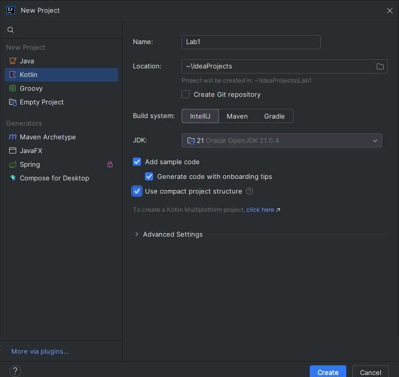
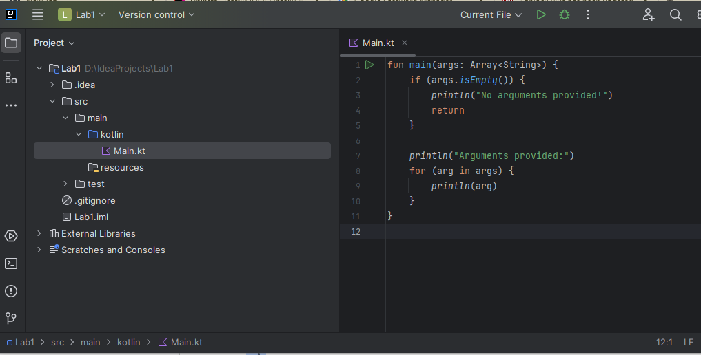
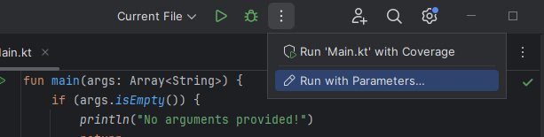
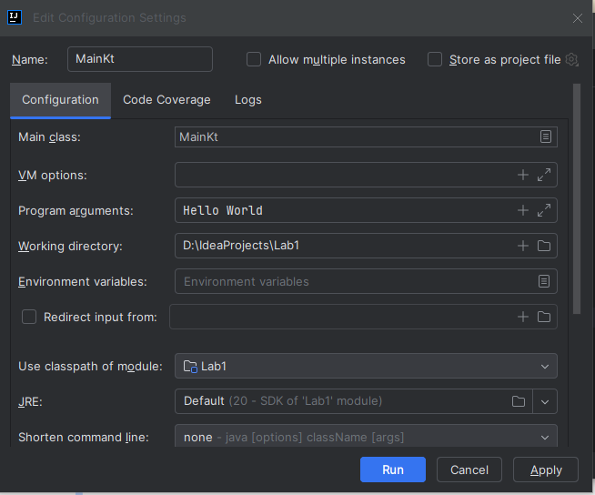
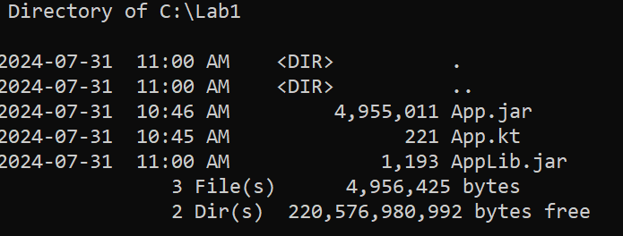
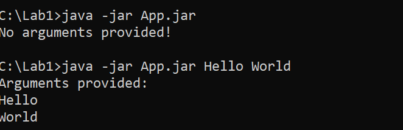
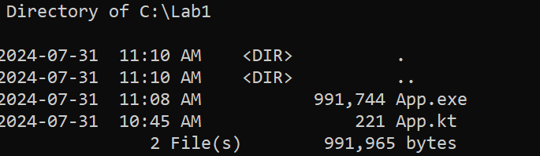
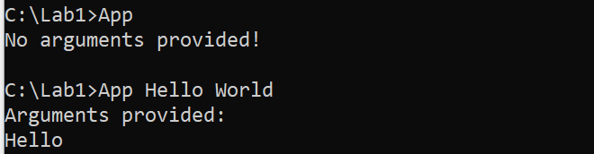

# Lab Kotlin Platforms
<!--suppress CheckImageSize -->

## Objectives

1. Run a basic Kotlin project in Intellij
2. Compile the project to a jar file at the command line
3. Compile the project to native executable at the command line

## Step 1 - Setup

### Logging into the VM

- Follow the steps in the demo to log into the VM assigned to you.

## Step 2 - Using IntelliJ

The IntelliJ IDE is the flagship product of JetBrains, the company that created Kotlin. The IDE ships with a Kotlin plugin that allows developers to build Kotlin and hybrid Kotlin/Java applications in the same project.

Other IDES also support Kotlin, but we will be using the community version of IntelliJ for this class. If you are using your own computer, it is strongly suggested that you install and use IntelliJ for this class. If you are using a different IDE, like Visual Studio Code or Eclipse, ensure that you have installed and tested Kotlin support.

#### Start IntelliJ

Start the IDE and select "New Project" from the opening screen. Choose the options as shown in the screenshot below. The explanations for the settings are below.

<!--suppress CheckImageSize -->


The location of the project folder is by default `C:\Users\Adminstrator\IdeaProject`. If you want to use a different location, go ahead and make the change. You can also call the project whatever you want.

Ensure that the IntelliJ build system is selected. Since the first part of the course uses core Kotlin and simple projects, there is no need for a more industrial strength build system like Gradle or Maven.

The jDK option specifies the version of Java the Kotlin code will compile to.

The compact project structure will generate a simpler project structure. By default, the `main()` function in a file called `Main.kt`. In the IDE, the build tool will generate an error if this file is not named `Main.kt`, but this is not a Kotlin requirement, but rather an IDE requirement

#### Add the Code

Replace the generated code with this snippet:

```Kotlin 
fun main(args: Array<String>) {
    if (args.isEmpty()) {
        println("No arguments provided!")
        return
    }

    println("Arguments provided:")
    for (arg in args) {
        println(arg)
    }
}
```

#### Run without and with command line Arguments

Run the code and confirm the output.



To run with command line arguments, select the three dots menu beside the debug icon at the top and select `Run with Arguments`



Then add whatever command line arguments you want and select `Run`



Confirm that the arguments were printed at the command line.

## Step 3 - Compiling to a jar file

- In a new directory, open a new file in Notepad. In the screenshots below, this directory `c:\Lab1`
- Cut and paste the code from `Main.kt` into the new file
- Save the file as `App.kt`
- Run the following command

```shell
C:\Lab1> kotlinc App.kt -include-runtime -d App.jar
```
- A full explanation of the syntax of the `kotlinc` compiler options is located [here](https://kotlinlang.org/docs/compiler-reference.html) 

- The `App.jar` file is a shaded jar file that contains all runtime library elements needed to run as a standalone library. If just a library is needed rather than a runtime is needed, the `-include-runtime` option can be omitted like this:

```shell
C:\Lab1> kotlinc App.kt  -d AppLib.jar
```

- The result should look like this.



- Run the jar file with and without arguments



## Step 4 - Compiling to Native code

- To create a native executable, run the following command which will generate a Windows `exe` file named `App.exe`

```shell
C:\Lab1> kotlinc-native App.kt -o App
```
 


- Then test the executable



---

## End Lab