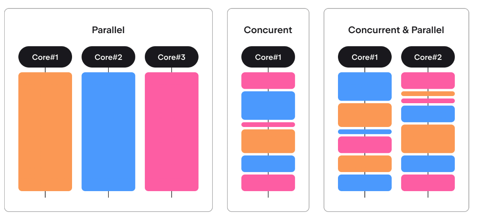
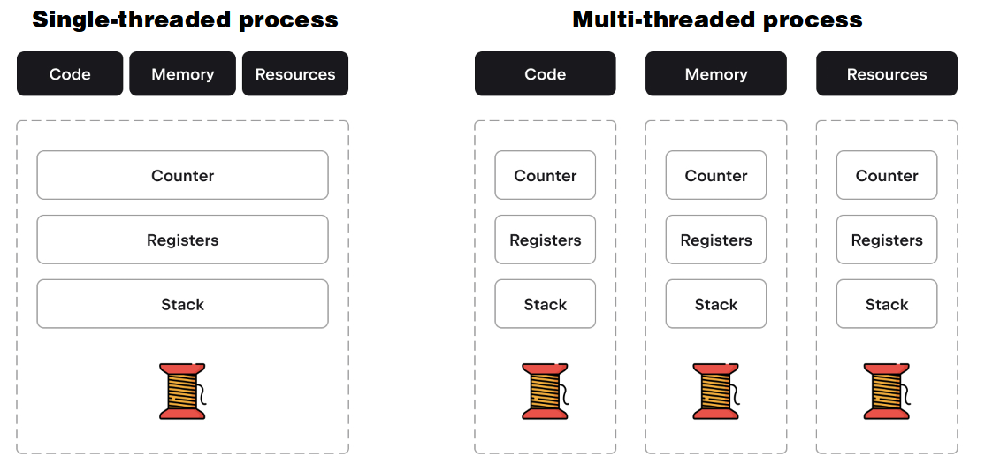
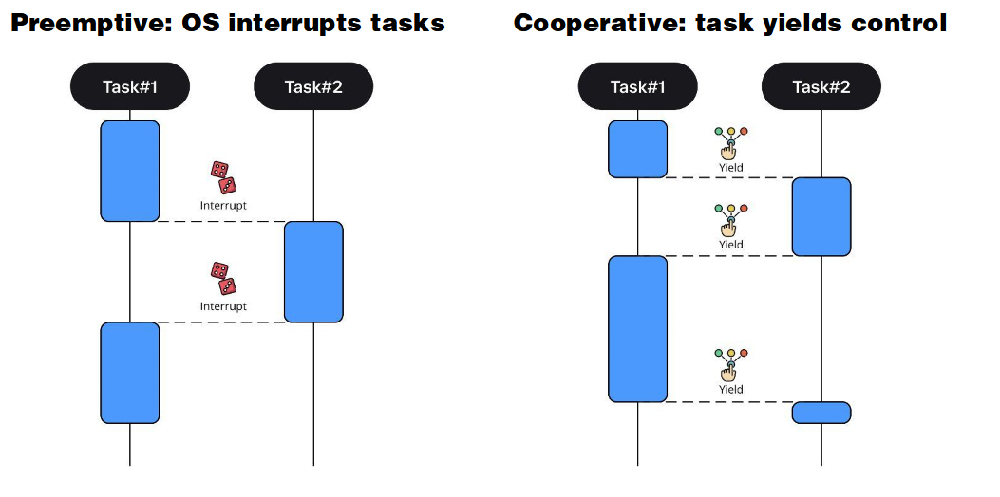
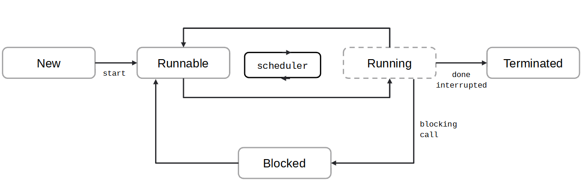
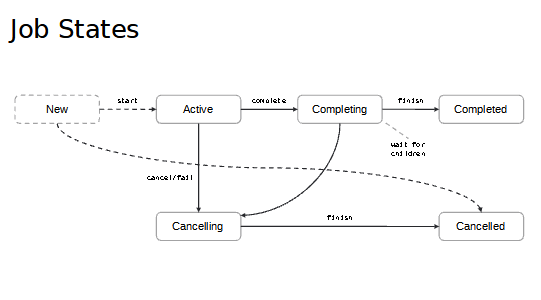

# 5. Asynchronous Programming

<!--suppress CheckImageSize -->


[Concurrency library](https://kotlinlang.org/api/latest/jvm/stdlib/kotlin.concurrent/)

---

## Some Basics

_Parallel computing_ is a type of computing “in which many calculations or processes are carried out simultaneously”.

_Concurrent computing_ is a form of computing in which several computations are executed concurrently – in overlapping time periods – instead of sequentially.

It is possible to have parallelism without concurrency, and concurrency without parallelism.

The difference between parallel and concurrent computing might not be obvious, but it is nevertheless very important, because it means that you can have  
- A parallel application
- A concurrent application
- A parallel and concurrent application

The main motivation for using parallelism is the desire to improve the performance of your code, as it allows you to split the workload into chunks that can be executed simultaneously, hence reducing the time spent on the task overall.

The main motivation for concurrency is the desire to increase responsiveness. This was used even before multicore processors to enable proper user interfaces.



In the diagram above, the three colours represent three different tasks. In the concurrent and parallel version, the three tasks take turns using the two cores.

#### Concurrency: processes versus threads



Operating systems work with processes. 
- Each process has its own (virtual) memory, executes its own code, and holds its own resources (like file descriptors) from the OS.
- For safety reasons, processes do not usually have access to the memory of other processes.

Threads, on the other hand, work in a single process, meaning that they share virtual memory and resources, while each has its own register, stack (frame), and program counter (the code that is being performed).



There are different models for scheduling, with the main difference being who or what decides to switch the execution context and when they do so.
- In a preemptive model, the OS scheduler chooses when each thread gets processor time and how much of this time it gets. The user has limited control over this, so it appears mostly random.
- In a cooperative model, there are specific points where the execution context can be switched. The user does not know which tasks will be chosen, but they do know where switches can happen.

#### Java Threading

The JVM has its own scheduler which is independent of the OS scheduler
- A JVM thread != an OS thread but maps to OS threads
- Multithreaded JVM apps can run on a single-threaded OS
- JVM threads are either daemons or user threads.
- The app stops when all user threads are done.
- The JVM does not wait for daemon threads to finish.

Kotlin/JVM is the basis for threading because the Kotlin/Native API is not yet stable and there is not a Parallel Programming API in Kotlin/Common yet.
- Usually, JVM threads are mapped 1-to-1 to OS threads, but that is not a requirement for JVM implementations, so N-to-1 (DOS) or 1-to-N mapping is also possible.
- JCM has recently implemented support for virtual threads
- User threads are used for common tasks, while daemon threads are used for services like logging, which are not essential, meaning it is not critical if some parts of their work is lost.
- The `Kotlin.concurrent` API has wrapper classes for the Java concurrency APIs

---

## Creating Threads

Threads can be created by subclassing the `Thread` class and overriding the `run()` method

```kotlin
package demo_5_1

// Subclass the Thread class
class MyThread : Thread() {
    override fun run() {
        // Define the task to be executed in the thread
        println("In thread ${Thread.currentThread().name}")
        for (i in 1..5) {
            println("Thread is running: $i")
            Thread.sleep(500)  // Sleep for 500 milliseconds
        }
    }
}

fun main() {
    // Create an instance of the subclassed Thread
    val myThread = MyThread()

    // Start the thread
    println("In main thread ${Thread.currentThread().name}")
    myThread.start()

    // Main thread continues to run independently
    println("Main thread is finishing...")
}
```
```shell
In main thread main
Main thread is finishing...
In thread Thread-0
Thread is running: 1
Thread is running: 2
Thread is running: 3
Thread is running: 4
Thread is running: 5
Process finished with exit code 0
```

Or they can be created by creating a Thread with the constructor that takes a runnable object.

```kotlin
package demo_5_2

// Create a runnable function
val myRunnable = {
    println("In thread ${Thread.currentThread().name}")
    for (i in 1..5) {
        println("Thread is running: $i")
        Thread.sleep(500)  // Sleep for 500 milliseconds
    }
}

fun main() {

    // Pass the Runnable instance to a Thread
    val thread = Thread(myRunnable)

    // Start the thread
    println("In main thread ${Thread.currentThread().name}")
    thread.start()

    // Main thread continues to run independently
    println("Main thread is finishing...")
}

```

However, the preferred way is to use the higher order function `thread` that is defined [here](https://kotlinlang.org/api/latest/jvm/stdlib/kotlin.concurrent/thread.html)

```kotlin
package demo_5_3
import kotlin.concurrent.thread

fun main() {
    println("In main thread ${Thread.currentThread().name}")
    // Start a new thread using the thread function
    thread {
        println("In thread ${Thread.currentThread().name}")
        // Define the task to be executed in the thread
        for (i in 1..5) {
            println("Thread is running: $i")
            Thread.sleep(500)  // Sleep for 500 milliseconds
        }
    }
    // Main thread continues to run independently
    println("Main thread is finishing...")
}

```

The `thread` method starts a new thread in the above code. If replaced with `run`, then the code is executed in the same thread.

Another way to write the above is:

```kotlin 
package demo_5_4
import kotlin.concurrent.thread

val task: () -> Unit = {

    for (i in 1..5) {
        println("Thread ${Thread.currentThread().name} is running: $i")
        Thread.sleep(500)  // Sleep for 500 milliseconds
    }
}

fun main() {
    println("In main thread ${Thread.currentThread().name}")
    // Start a new thread using the thread function
    thread(block = task, name="myThread")
    // Main thread continues to run independently
    println("Main thread is finishing...")
}
```
```shell
In main thread main
Main thread is finishing...
Thread myThread is running: 1
Thread myThread is running: 2
Thread myThread is running: 3
Thread myThread is running: 4
Thread myThread is running: 5
```

#### Thread properties

A thread's properties cannot be changed after it is started. Main properties of a thread:
- _id:_ Long — This is the thread's identifier
- _name:_ String
- _priority:_ Int — This can range from 1 to 10, with a larger value indicating higher priority
_- daemon:_ Boolean
- _state:_ Thread.state
- _isAlive:_ Boolean

_State_ is specific, while _isAlive_ is a flag that is easier to understand and just signals that the thread is executing something. When a thread has been created but has not started, it has nothing to execute and is not alive. When the thread has finished all of its work, or after it encounters an error, it is also not alive.

There are different “blocked” states, because a thread can be blocked for different reasons.
- Blocked means it is waiting for some OS events, like writing to a socket.
- Waiting means it is waiting for some resource, like a lock or a condition.
- Timed waiting means the thread is sleeping or performing a blocking operation with timeout.
  


_Runnable_ is a state that indicates that a thread can be executed, meaning that it is up to the scheduler to decide whether it will be. The scheduler can move the thread away from the process (park it) at an arbitrary moment in time/statement in code.
- The _Running_ box is dashed, because we can think of it as a virtual state.
- It would make no sense to have a separate `Thread.state` for “_Running_”, because by the time you got this information, there’s a good chance that the scheduler would already have moved the thread back to Runnable.
- A thread can go to the _Waiting_ or _Blocked_ state only from the _Running_ state because the thread has to perform specific operations to block itself or to start waiting.

#### Manipulating Thread states

- _val myThread = thread { ... }_ — Creates a new 
- _myThread.start()_ — Starts a thread
- _myThread.join()_ — Causes the current thread to wait for another thread to finish
- _sleep(...)_ —  Puts the current thread to sleep
- _yield()_ — Tries to step back
- _myThread.interrupt()_ — Tries to interrupt a thread
- _myThread.isInterrupted()_ — Checks whether thread was interrupted
- _interrupted()_ — Checks and clears the interruption flag


The sleep and yield methods are only applicable to the current thread, which means that you cannot suspend another thread. All blocking and waiting methods can throw _InterruptedException_

An example of interrupting a thread is in demo 5.5

```kotlin
package demo_5_5
import kotlin.concurrent.thread

fun main() {
    // Create and start a thread
    val myThread = thread(start = true) {
        try {
            for (i in 1..10) {
                // Check if the thread has been interrupted
                if (Thread.currentThread().isInterrupted) {
                    println("Thread was interrupted, stopping execution...")
                    return@thread
                }

                println("Thread is running: $i")
                Thread.sleep(1000)  // Simulate some work by sleeping for 1 second
            }
        } catch (e: InterruptedException) {
            println("Thread interrupted during sleep, stopping execution...")
        }
    }

    // Main thread waits for 3 seconds before interrupting the other thread
    Thread.sleep(3000)
    println("Interrupting the thread...")
    myThread.interrupt()  // Interrupt the thread

    // Optionally, wait for the thread to finish
    myThread.join()
    println("Thread has finished.")
}
```
```shell
Thread is running: 1
Thread is running: 2
Thread is running: 3
Interrupting the thread...
Thread interrupted during sleep, stopping execution...
Thread has finished.
```
---

### Thread Problems

- In reality, programs (threads) spend a lot of time waiting for data to be fetched from disk, network, etc.
- The number of threads that can be launched is limited by the underlying operating system (each takes some number of MBs).
- Threads aren’t cheap, as they require context switches which are costly.
- Threads aren’t always available. Some platforms, such as JavaScript, do not even support them.
- Working with threads is hard. Bugs in threads (which are extremely difficult to debug), race conditions, and deadlocks are common problems we suffer from in multithreaded programming.
Threads terminating due to exceptions is a problem that deserves to be a separate point.

In practice, applications frequently work with the network and must do so for external events. This results in them spending a lot of time not doing anything useful.

There’s a seemingly obvious solution to the problem of having a considerable number of threads that remain blocked because they’re waiting for an I/O operation to finish: we can just increase the number of threads so that they can complete more useful work while some of them are being blocked. This does not always work, however, because there is a limit to the number of threads an application can use. This limit might come from the OS or simply from not having enough memory to store the desired amount of threads, because each thread requires MBs of memory for its stack and so on.

Furthermore, simply doubling the number of threads, for instance, will not cut execution time in half, as when there are more threads, more time is spent switching contexts to get to the processor before beginning to do anything useful.Creating two times more threads does not speed up the execution time twofold, because more threads require more context switching to get to the processor and start actually executing something useful. The more threads there are, the larger the percentage of time spent managing those threads instead of doing actual work.

Moreover, multi-threaded applications require thorough control over shared resources due to the huge number of multi-threaded specific problems, like race-conditions and deadlocks. When these problems arise, they are extremely difficult to debug and localize.

Another problem is that not everything always goes according to the plan, and exceptions are bound to happen. When an unhandled exception occurs, the thread terminates, and this situation is extremely hard to deal with from another thread.

---

## Coroutines


Coroutines are not a new concept. They existed long before Kotlin, Java, and even C. Coroutines can make up an application that will work on a cooperative multitasking model, where threads mostly work in preemptive multitasking.  Recently coroutines have found their way into a lot of languages.

- Melvin Conway coined the term “coroutine” in 1958 for his assembly program.
- Coroutines were first introduced as a language feature in Simula’67 with the detach and resume commands.
- A coroutine can be thought of as an instance of a suspendable computation, i.e. one that can suspend at some point and later resume execution, possibly even on another thread.
- Coroutines calling each other (and passing data back and forth) can form the machinery for cooperative multitasking.

[Kotlin Documentation](https://kotlinlang.org/docs/coroutines-basics.html)


A coroutine is an instance of suspendable computation. It is conceptually similar to a thread in the sense that it takes a block of code to run and has a similar life-cycle. It is created and started, but it is not bound to any particular thread. It may suspend its execution in one thread and resume in another one. Moreover, like a future or a promise, it can complete with some result (which is either a value or an exception).

### Coroutine Scope

A coroutine scope in Kotlin defines the context in which coroutines are launched and controls their lifecycle. It helps manage coroutines by ensuring that they are properly structured and that they can be cancelled or completed as a group.

`CoroutineScope` is an interface provided by the standard library, and its implementation can be found in `kotlinx.coroutines` or written from scratch. This interface only has one field – `CoroutineContext`.

#### Context and Lifecycle Management:

- A coroutine scope provides a context that is shared among all the coroutines launched within it. 
- this context includes elements like the dispatcher, job, and other coroutine-related configurations.
- Coroutines launched within a scope inherit the context and are children of the scope. This means if the scope is cancelled, all the coroutines in that scope are also cancelled.

#### Hierarchical Structure:
- Coroutines can be structured hierarchically using scopes. For example, a parent coroutine can launch child coroutines, and cancelling the parent coroutine will cancel all its children.

#### Built-in Scopes:

Kotlin provides some built-in coroutine scopes for common use cases:
- _GlobalScope_: A global scope that is tied to the lifetime of the entire application, but should be used sparingly because it is not bound to any specific lifecycle.
- _runBlocking_: A blocking scope that runs a coroutine and blocks the current thread until it completes.
- _CoroutineScope_: A general-purpose scope that can be used in custom classes, activities, or other components to manage coroutines tied to their lifecycle.

### Coroutine Contexts

`CoroutineContext` is an interface that is designed to store information about the execution environment for coroutines. You can think of it as a map from a class to an instance (object) of that class in the environment.

Each element of the context is a context on its own. It is designed to make working with contexts easy. For example, you can create a context by simply creating an instance of `CoroutineName`, and then you can add `CoroutineDispatcher` by simply using plus, which is overridden for contexts.

Why do we even need `CoroutineScope` if it only has one property – `CoroutineContext`? Couldn’t we achieve the same result by just using `CoroutineContext`?

This division is used to separate the coroutine’s execution environment/state, which is the context, from its behavior/lifecycle, which is the scope. We will revisit this idea when discussing structured concurrency.

### Dispatchers

A coroutine dispatcher in Kotlin is a component that determines the thread or thread pool on which a coroutine will run. It controls how and where the coroutine's execution is scheduled, allowing you to specify whether a coroutine should run on the main thread, a background thread, or a pool of threads optimized for specific tasks like I/O operations or CPU-intensive work.

Some of this is demonstrated in demo 5.7

```kotlin 
package demo_5_7

import kotlinx.coroutines.*

fun main() = runBlocking {
    println("Main context: $coroutineContext")
    println("Main name: ${coroutineContext[CoroutineName]}")
    println("Main scope: $this")
    println("Main Thread being used: ${Thread.currentThread().name}")

    // Create a coroutine scope
    val scope = CoroutineScope(Dispatchers.Default)
   // val scope = CoroutineScope(Dispatchers.Unconfined)
    // Launch a coroutine within the scope
    scope.launch(CoroutineName("Demo5-7")) {
        delay(1000L)
        println("Coroutine context: $coroutineContext")
        println("Coroutine name: ${coroutineContext[CoroutineName]}")
        println("Coroutine scope: $this")
        println("Thread being used: ${Thread.currentThread().name}")
    }

    // Optionally, cancel the scope to cancel all coroutines within it
    //scope.cancel()

    println("Main program continues...")
    delay(2000L) // Delay to keep the main thread alive until the coroutine completes
}

```

A more detailed example from the Kotlin documentation:

```kotlin
package demo_5_8

import kotlinx.coroutines.*

@DelicateCoroutinesApi
@OptIn(ExperimentalCoroutinesApi::class)

fun main() = runBlocking<Unit> {
    launch { // context of the parent, main runBlocking coroutine
        println("main runBlocking      : I'm working in thread ${Thread.currentThread().name}")
    }
    launch(Dispatchers.Unconfined) { // not confined -- will work with main thread
        println("Unconfined            : I'm working in thread ${Thread.currentThread().name}")
    }
    launch(Dispatchers.Default) { // will get dispatched to DefaultDispatcher
        println("Default               : I'm working in thread ${Thread.currentThread().name}")
    }
    launch(newSingleThreadContext("MyOwnThread")) { // will get its own new thread
        println("newSingleThreadContext: I'm working in thread ${Thread.currentThread().name}")
    }
}
```

```text
Unconfined            : I'm working in thread main
Default               : I'm working in thread DefaultDispatcher-worker-1
newSingleThreadContext: I'm working in thread MyOwnThread
main runBlocking      : I'm working in thread main
```

Inside the `CoroutineScope` we can write ordinary code or launch a coroutine that will asynchronously work in the background without blocking the main execution thread. We can think about `launch` as “fire and forget”. 

The code does not wait for `launch` to do anything, it just gets thrown into the scope to be executed at some point, while execution continues as though nothing happened. `launch` accepts a suspending block as an argument, which will be the code executed in a new coroutine. Things like `launch` that allow you to create new coroutines are called coroutine builders.

#### Unconfined dispatcher

Basically uses whatever thread is available when it resumes from a delay. Example from the Kotlin documentation.

```kotlin
package demo_5_9

import kotlinx.coroutines.*

fun main() = runBlocking<Unit> {
    launch(Dispatchers.Unconfined) { // not confined -- will work with main thread
        println("Unconfined      : I'm working in thread ${Thread.currentThread().name}")
        delay(500)
        println("Unconfined      : After delay in thread ${Thread.currentThread().name}")
    }
    launch { // context of the parent, main runBlocking coroutine
        println("main runBlocking: I'm working in thread ${Thread.currentThread().name}")
        delay(1000)
        println("main runBlocking: After delay in thread ${Thread.currentThread().name}")
    }
}
```
```text
Unconfined      : I'm working in thread main
main runBlocking: I'm working in thread main
Unconfined      : After delay in thread kotlinx.coroutines.DefaultExecutor
main runBlocking: After delay in thread main
```


## Extract function refactoring

[Kotlin Documentation](Extract function refactoring)

Note that the `suspend` keyword helps the compiler know this is a function called from inside a coroutine scope and therefore can use the `delay()` function

```kotlin
package demo_5_10

import kotlinx.coroutines.*

fun main() = runBlocking { // this: CoroutineScope
    launch { doWorld() }
    println("Hello")
}

// this is your first suspending function
suspend fun doWorld() {
    delay(1000L)
    println("World!")
}

```

## Scope builder and concurrency

[Kotlin documentation](https://kotlinlang.org/docs/coroutines-basics.html#scope-builder-and-concurrency)

- _runBlocking:_ It blocks the thread it's running on, meaning the thread can't do anything else while waiting. It's like telling the thread, "Stop everything and just wait here until all tasks are done."
- _coroutineScope:_ It suspends the current function, which means the thread is freed up and can be used for other tasks while waiting. It's like saying, "Hey, I'm waiting for these tasks, but you can go do something else in the meantime."

```kotlin
package demo_5_11

import kotlinx.coroutines.*

// Sequentially executes doWorld followed by "Done"
fun main() = runBlocking {
    println("main runBlocking: I'm working in thread ${Thread.currentThread().name}")
    doWorld()
    println("Done")
}

// Concurrently executes both sections
suspend fun doWorld() = coroutineScope { // this: CoroutineScope
    println("doWorld: I'm working in thread ${Thread.currentThread().name}")
    launch {
        println("first launch: I'm working in thread ${Thread.currentThread().name}")
        delay(2000L)
        println("World 2")
    }
    launch {
        println("first launch: I'm working in thread ${Thread.currentThread().name}")
        delay(1000L)
        println("World 1")
    }
    println("Hello")
}
```
```shell
main runBlocking: I'm working in thread main
doWorld: I'm working in thread main
Hello
first launch: I'm working in thread main
first launch: I'm working in thread main
World 1
World 2
Done
```

---

## Jobs

[Kotlin Documenation](https://kotlinlang.org/docs/coroutines-basics.html#an-explicit-job)

One of the main uses of jobs is to allow us to send messages to coroutines

```kotlin
package demo_5_12

import kotlinx.coroutines.*

fun main() = runBlocking {
    val job1 = launch { // launch a new coroutine and keep a reference to its Job
        delay(2000L)
        println("This is job 1")
    }
    val job2 = launch { // launch a new coroutine and keep a reference to its Job
       // job1.cancel()
       // job1.join()
        delay(1000L)
        println("This is job 2")
    }
    println("Hello")
   //job1.join() // wait until child coroutine completes
    println("Done")
}
```

And we can nest coroutines like this

```kotlin
package demo_5_13

import kotlinx.coroutines.*

fun main() = runBlocking {
    val job1 = launch { // launch a new coroutine and keep a reference to its Job
        val job2 = launch { // launch a new coroutine and keep a reference to its Job
            delay(3000L)
            println("This is job 2")
        }
        //job2.join()
        delay(1000L)
        println("This is job 1")
    }

    println("Hello")
    //job1.join() // wait until child coroutine completes
    // job1.cancel()
    println("Done")
}
```

### Job states



Job has similar states to Thread.

The major difference is that Job has no blocked state, since coroutines suspend instead of blocking.

Also, both the Cancelled and Completed states are accompanied by their ‘-ing’ analog. These exist because the coroutine finishes only when all of its children finish.

This means that a Job (coroutine) might complete all of its work successfully, but then it has to wait for its children to do the same, and one of its children might fail at this stage. If this happens, then despite Job itself succeeding, the whole load of work that was connected to it, including all of its children, has failed, and that is signaled by Job transitioning to the Cancelling and then Cancelled states.

In Kotlin, coroutines and jobs are closely related but conceptually different. Here's an explanation of each and how they relate to each other:

#### Coroutine:

- A coroutine is a concept that represents a computation or task that can be suspended and resumed. Coroutines allow you to write asynchronous, non-blocking code in a sequential style. They are lightweight and can be used to perform tasks concurrently without blocking the main thread.
- When you launch a coroutine, it can perform some work, suspend itself to wait for some condition (like waiting for a network response), and then resume from where it left off once the condition is met. The suspension and resumption happen without blocking the underlying thread.
- The focus of a coroutine is on the code execution, defining what should be done, and how it can be paused and resumed.

#### Job:

- A Job is a handle or reference to a coroutine. It represents a background task or a unit of work that is being performed by a coroutine. The Job interface allows you to manage the lifecycle of a coroutine, such as checking its status, canceling it, or waiting for its completion.
- When you launch a coroutine (using launch or other coroutine builders), it returns a Job object. This Job can be used to interact with the coroutine. For instance, you can check if the coroutine is still active, cancel it, or wait until it completes.
- The focus of a Job is on controlling and managing the lifecycle of the coroutine, not on the execution of the coroutine's code itself.

Every coroutine has an associated Job. The Job is what allows you to manage the coroutine after it has been launched. Think of the Job as the "control panel" for the coroutine. While the coroutine is doing its work, the Job gives you the tools to check on, cancel, or wait for that work to finish.

---

## Coroutine context and dispatchers

[Kotlin Documentation](https://kotlinlang.org/docs/coroutine-context-and-dispatchers.html)

#### Coroutines are Lightweight:

Coroutines are much lighter than threads. You can have thousands of coroutines running on a few threads because coroutines don’t need a dedicated thread for each one. They share threads and can be suspended and resumed, allowing the thread to be used for other tasks in the meantime.

#### Dispatchers Determine Thread Usage:

In Kotlin, dispatchers control which thread or threads a coroutine will run on. There are several built-in dispatchers:
- Dispatchers.Default: Uses a pool of shared background threads, ideal for CPU-intensive tasks.
- Dispatchers.IO: Uses a pool of threads optimized for I/O operations, like reading from disk or network.
- Dispatchers.Main: Runs coroutines on the main thread, typically used for UI updates in Android apps.
- Dispatchers.Unconfined: Starts the coroutine in the caller thread but only until the first suspension point. After that, it resumes in whatever thread is available.

#### Suspension and Resumption:

When a coroutine is suspended (paused), the thread it was using is freed up to do other work. When the coroutine is ready to resume, it may continue on the same thread or a different one, depending on the dispatcher and the availability of threads.

#### Thread Reuse:

Because coroutines can suspend and resume, they make very efficient use of threads. For example, a coroutine might start on one thread, get suspended (say, waiting for data), and when it’s ready to resume, it might continue on a different thread. This allows for better use of resources compared to traditional threading, where each thread is typically blocked and waiting during such operations.

### Unconfined vs confined dispatcher

[Kotlin Documentation](https://kotlinlang.org/docs/coroutine-context-and-dispatchers.html#unconfined-vs-confined-dispatcher)

```kotlin

package demo_5_14

import kotlinx.coroutines.*

fun main() = runBlocking<Unit> {
    launch(Dispatchers.Unconfined) { // not confined -- will work with main thread
        println("Unconfined      : I'm working in thread ${Thread.currentThread().name}")
        delay(500)
        println("Unconfined      : After delay in thread ${Thread.currentThread().name}")
    }
    launch { // context of the parent, main runBlocking coroutine
     //   launch(Dispatchers.Default) { // override
        println("main runBlocking: I'm working in thread ${Thread.currentThread().name}")
        delay(1000)
        println("main runBlocking: After delay in thread ${Thread.currentThread().name}")
    }
}
```

```shell
Unconfined      : I'm working in thread main
main runBlocking: I'm working in thread main
Unconfined      : After delay in thread kotlinx.coroutines.DefaultExecutor
main runBlocking: After delay in thread main
```

---

## Coroutine scope

[Kotlin Documentation](https://kotlinlang.org/docs/coroutine-context-and-dispatchers.html#coroutine-scope)

A coroutine scope in Kotlin is used to manage the lifecycle of coroutines. It ensures that coroutines are properly started, stopped, and cleaned up when no longer needed, preventing potential memory leaks and ensuring that resources are used efficiently. By using scopes, you get structured concurrency, which makes your concurrent code more predictable and manageable.

### Coroutine Scopes?

_Global Scope:_ This scope is tied to the application's lifecycle, so coroutines launched in GlobalScope will keep running as long as the app is alive. It’s not recommended for most cases because it doesn’t have structured concurrency, meaning coroutines can outlive their intended purpose.

_CoroutineScope:_ This is the most common way to create a scope. For example, in an Android app, you might use a CoroutineScope tied to the lifecycle of a ViewModel or an activity. This way, when the ViewModel or activity is destroyed, the scope is canceled, and all coroutines are automatically cleaned up.

_runBlocking:_ This is a special scope used to bridge between blocking and non-blocking code. It blocks the current thread until all coroutines inside it complete. It’s commonly used in main functions or tests.

```kotlin
package demo_5_16

import kotlinx.coroutines.*

fun main() {
    // Creating a custom coroutine scope with a Job and Dispatcher
    val myCoroutineScope = CoroutineScope(Job() + Dispatchers.Default)

    // Launching a coroutine within the custom scope
    myCoroutineScope.launch {
        try {
            val data = fetchDataFromNetwork()
            println("Data fetched: $data")
        } catch (e: Exception) {
            println("Error fetching data: ${e.message}")
        }
    }

    // Simulate some other work in the main thread
    println("Main thread is running...")

    // Keeping the main thread alive to see coroutine's output
    Thread.sleep(3000)

    // Cancel the scope to clean up any running coroutines
    myCoroutineScope.cancel()
}

// Simulating a network call that fetches data
suspend fun fetchDataFromNetwork(): String {
    delay(2000) // Simulate network delay
    return "Fetched Data"
}

```

The GlobalScope in Kotlin is a global coroutine scope that can be used to launch coroutines that live for the entire duration of the application. While it is useful for certain long-running tasks, it should be used carefully to avoid potential issues like memory leaks or unintended long-lived operations. In general, it's recommended to use more specific coroutine scopes when possible to better manage the lifecycle of coroutines.

#### When to Use GlobalScope:

When you need to perform tasks that should run for the entire duration of the application, such as background data syncing or monitoring.

Since GlobalScope coroutines are not automatically canceled, it's easy to create coroutines that could potentially cause memory leaks or continue running even when they are no longer needed. For most use cases, it's better to use a scoped coroutine tied to a specific lifecycle (like viewModelScope or a custom CoroutineScope).

```kotlin
import kotlinx.coroutines.*

fun main() {
    println("Main program starts: ${Thread.currentThread().name}")

    // Launch a coroutine in the GlobalScope
    GlobalScope.launch {
        println("Fake network request starts: ${Thread.currentThread().name}")
        val data = fetchDataFromNetwork()
        println("Data fetched: $data")
    }

    // Simulate some other work in the main thread
    println("Main thread is doing other work...")

    // Keep the main thread alive for a while to see the coroutine's output
    Thread.sleep(3000) // Not needed in a real application with an event loop or main loop

    println("Main program ends: ${Thread.currentThread().name}")
}

// Simulating a network call that fetches data
suspend fun fetchDataFromNetwork(): String {
    delay(2000) // Simulate network delay
    return "Fetched Data"
}
```

---

## Coroutine builders

Coroutines are created using coroutine builders. Three of the most commonly used coroutine builders are runBlocking, launch, and async. Each of these builders serves a different purpose and is used in different contexts. 

#### runBlocking

- Used to bridge the gap between blocking and non-blocking code. It is typically used in the main function or in tests where you need to execute suspending functions in a blocking manner.
- It blocks the current thread until the coroutine inside it completes.
- The coroutine started with runBlocking will run on the current thread (e.g., the main thread) and block it until completion.
- Useful for writing simple scripts, quick tests, or when you need to run coroutine code in a blocking context, such as in the main function of a console application.

#### launch

- Launch is used to start a new coroutine that doesn't return a result. It is the most common way to start a coroutine that performs some work asynchronously and does not require a return value.
- It launches a coroutine in the background and immediately returns a Job object, which represents the coroutine's lifecycle. The launch builder is fire-and-forget, meaning it doesn't provide a result but just starts the coroutine.
- Ideal for launching coroutines that perform side effects, such as updating the UI, logging, or running background tasks where you don't need a result.

#### async

- Used to start a new coroutine that will return a result. It is similar to launch, but it is designed for coroutines that need to return a value.
- It launches a coroutine and returns a Deferred object, which represents a future result of the coroutine. The Deferred can be awaited to get the result once the coroutine completes.
- Useful for performing parallel tasks that need to return results, such as making multiple network requests concurrently and combining their results.

```kotlin
package demo_5_18
import kotlinx.coroutines.*

fun main() = runBlocking {
    println("Launch async")
    val deferredResult = async {
        delay(1000L)
        "Result from async"
    }
    println("Main program continues")
    val result = deferredResult.await()  // Await the result
    println("Async result: $result")
}
```

---

## Channels

[Kotlin Documentation](https://kotlinlang.org/docs/channels.html)

A channel is a way to send and receive data between coroutines.It can be thought  of a pipeline or a queue where one coroutine can put (send) data in, and another coroutine can take (receive) that data out.
- Sending Data: One coroutine can "send" data into the channel, like putting a message into a mailbox.
- Receiving Data: Another coroutine can "receive" data from the channel, like taking the message out of the mailbox.

```kotlin
package demo_5_19

import kotlinx.coroutines.*
import kotlinx.coroutines.channels.*

fun main() = runBlocking<Unit> {
    // Create a channel to send and receive integers
    val channel = Channel<Int>()

    // Launch a coroutine to send data into the channel
    launch {
        for (i in 1..5) {
            channel.send(i)  // Sending data
            println("Sent: $i")
        }
        channel.close()  // Closing the channel after sending
    }

    // Launch a coroutine to receive data from the channel
    launch {
        for (i in channel) {  // Receiving data
            println("Received: $i")
        }
    }
}
```
Note that it appears some messages were received before they were sent because of the queuing up of the print messages

```shell
Received: 1
Sent: 1
Sent: 2
Received: 2
Received: 3
Sent: 3
Sent: 4
Received: 4
Received: 5
Sent: 5

```

##### Closing a channel

```kotlin
package demo_5_20

import kotlinx.coroutines.*
import kotlinx.coroutines.channels.*

fun main() = runBlocking {
    val channel = Channel<Int>()
    launch {
        for (x in 1..5) channel.send(x * x)
        channel.close() // we're done sending
    }
    // here we print received values using `for` loop (until the channel is closed)
    for (y in channel) println(y)
    println("Done!")
}
```
```shell
1
4
9
16
25
Done!
```

### Producers

Creates a coroutine that produces a stream of values, returning a ReceiveChannel. It’s typically used in producer-consumer scenarios.

```kotlin
import kotlinx.coroutines.*
import kotlinx.coroutines.channels.*

fun main() = runBlocking {
    val channel = produce {
        for (x in 1..5) {
            send(x)
            delay(100L)
        }
    }

    for (y in channel) {
        println(y)
    }
}

```

### Actors

Launches a coroutine that processes messages sent to its mailbox (an ActorScope). It returns a SendChannel, used to send messages to the actor.

```kotlin
package demo_5_22

import kotlinx.coroutines.*
import kotlinx.coroutines.channels.*

fun main() = runBlocking<Unit> {
    val actor = actor<Int> {
        var sum = 0
        for (msg in channel) {
            sum += msg
            println("Received $msg, sum is now $sum")
        }
    }

    actor.send(1)
    actor.send(2)
    actor.send(3)
    actor.close()  // Closing the actor
}

```

```shell
Received 1, sum is now 1
Received 2, sum is now 3
Received 3, sum is now 6
```

---

##  Asynchronous Flow

[Kotlin Documentation](https://kotlinlang.org/docs/flow.html)

A `sequence` is a way to handle a collection of data elements in a lazy manner. This means that elements are processed one by one, only when needed, rather than all at once. This is particularly useful when dealing with large collections or potentially infinite data, as it helps save memory and processing power.


    Lazy Evaluation: Unlike regular collections like List or Set, where all elements are processed immediately, sequences process each element on demand. This means elements are computed only when you access them, rather than upfront.

    Efficient with Large Data: Sequences are ideal for working with large datasets or streams of data where you don't want to load everything into memory at once.

    Potentially Infinite: You can create sequences that could, in theory, generate an infinite number of elements. Since they are evaluated lazily, you can work with such sequences without running out of memory, as long as you only access a finite number of elements.