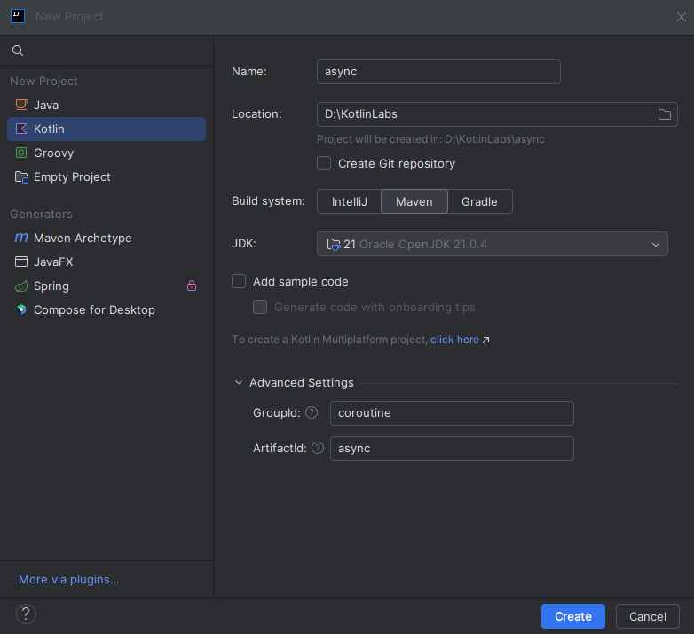
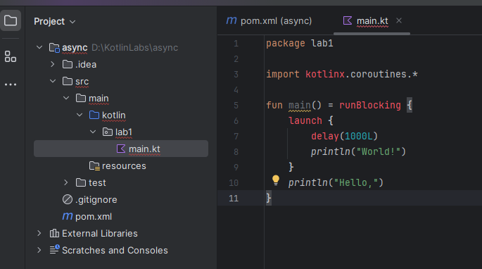
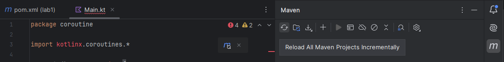

# Lab 5-2  Corountine project setup

<!--suppress CheckImageSize -->

## Step 1 - Setup for the project

Using co-routines requires the use of the use of an additional library that has to be downloaded and installed on your machine. The simplest way to do this is by using either a gradle or maven project to automatically import the dependencies for you. For this lab we will use a maven project, but if you prefer to use gradle, you can do that as well.

Create a new maven Kotlin project with the following configuration so that it resembles what is in the lab notes. Note that the location of the projects should be the directory you are currently using for this class



- Notice that Maven is selected as the build tool.
- Also notice that we are not generating sample code

---

## Step 2 - Add the dependencies

Add the following snippet to the POM file as shown. The snippet is in the lab directory in the file `pomsnippet.txt`

```xml
<!-- https://mvnrepository.com/artifact/org.jetbrains.kotlinx/kotlinx-coroutines-core -->
<dependency>
    <groupId>org.jetbrains.kotlinx</groupId>
    <artifactId>kotlinx-coroutines-core</artifactId>
    <version>1.9.0-RC</version>
    <type>pom</type>
</dependency>
```

If you are copying the dependency from Maven Central, remove the last line that specifies the runtime scope.

If you are using gradle, the equivalent dependency are shown (not tested by the author)

```text
repositories {
    mavenCentral()
}

dependencies {
    implementation 'org.jetbrains.kotlinx:kotlinx-coroutines-core:1.7.3'
    testImplementation 'org.jetbrains.kotlin:kotlin-test'
}
```

```kotlin
import kotlinx.coroutines.*

fun main() = runBlocking {
    launch {
        delay(1000L)
        println("World!")
    }
    println("Hello,")
}
```

---

## Step 3 - Add the sample code

Create a new package `lab1` as shown, and add a new file `Main.kt` to that package. Add the following code to the file you created.


```kotlin
import kotlinx.coroutines.*

fun main() = runBlocking {
    launch {
        delay(1000L)
        println("World!")
    }
    println("Hello,")
}
```

Your project should look like this:



This should result in a number of errors since we haven't yet installed the dependencies. Your screen should look like this:

# Step 4 - Update the Project

Open the Maven icon (the "m") and click the rebuild option, the two circular arrows, to actually download and install the dependencies



You should see all the errors disappear. If not, double check that you added the dependency correctly into the POM file.

## Step 5 - Run the code

Run the code normally and you should see the output

```shell
Hello,
World!
```

### You can reuse this project for the next few labs so don't delete it.

---

## End Lab