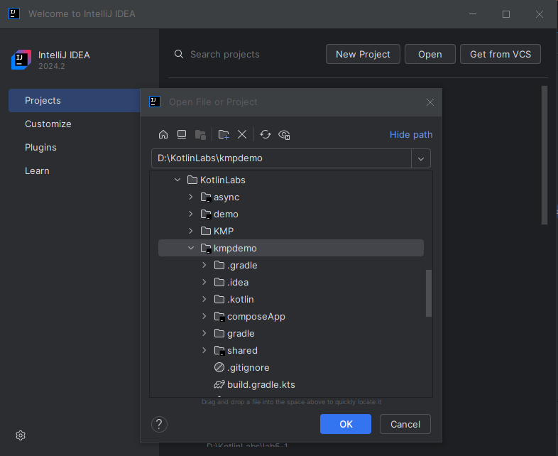

# Lab 6-1  Higher Order Functions
<!--suppress CheckImageSize -->

## Setting up a KMP project

We will set up the project in two different ways. First by creating it IntelliJ. The same can be done in other JetBrains IDE like Android Studio

## Step 1 - Install the plugin.

Start the IntelliJ IDE. Close any projects you have open. 

Select `Plugins` and in the `Marketplace` option, search for `Kotlin-multi` and select `install`

---

## Step 2 - Create the Project

Once the plugin is installed, restart the IDE. Once it is restarted, select `New Project` and you should see the plugin wizard. Select the plugin and the following window should open.

Select the options as shown. Note that we do not see an iOS option because the IDE knows we are in a Windows Environment.

Select `Create`

The resulting project should look like this

---

## Alternate Step 2 - Using the online wizard

There is a online wizard at [https://kmp.jetbrains.com/](https://kmp.jetbrains.com/)

 

Scroll down a bit and select `download`. This will download a zip file containing the project.

Unzip the file and locate the contents to a directory.

Then open the project in the IDE.

YOu should see the same sort of project structure but time with an iOS section as well.

The project structure is flexible. It is convention to organize the folders like this, but there can be variations. What is important is that we are separating out the code base into more cohesive modules

By default, the project has a sort of hello world app as a starter. We will experiment with this in the next lab.

## End Lab

